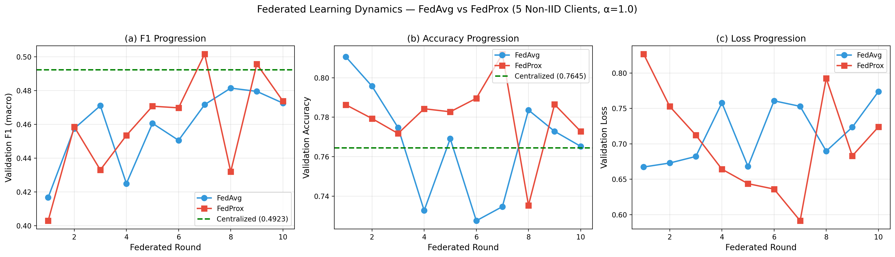
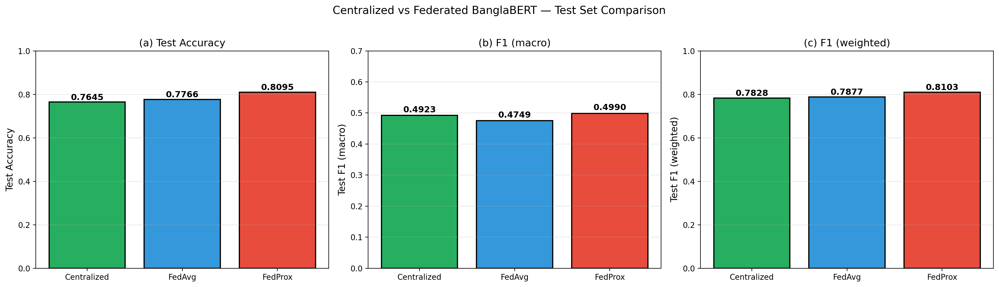
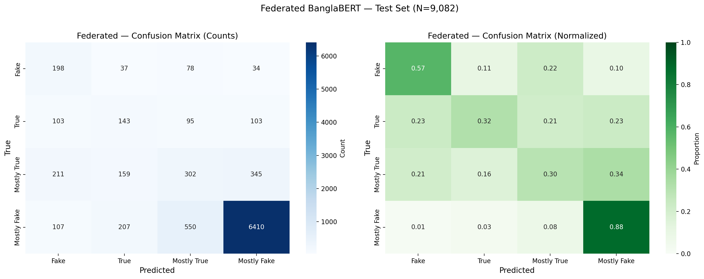

# A Privacy-Preserving Federated Learning Framework for Multi-Class Bengali Fake News Detection on Resource-Constrained Devices

**Md. Murad Hossain**  
Department of Computer Science and Engineering  
Uttara University, Dhaka, Bangladesh  
Email: 2231081044@uttarauniversity.edu.bd

---

## Abstract

The proliferation of fake news in low-resource languages like Bengali poses a significant challenge to information integrity. Existing detection methods rely on centralized training, which requires aggregating sensitive user data and raises privacy concerns. In this paper, we propose a privacy-preserving federated learning framework for multi-class Bengali fake news detection on resource-constrained devices. Using the BanFakeNews-2.0 dataset (60,544 news articles, 4 classes), we evaluate three approaches: (1) centralized BanglaBERT, (2) federated FedAvg, and (3) federated FedProx, under a realistic Non-IID data distribution (Dirichlet α=1.0, 5 clients). Our proposed FedProx framework achieves a macro F1-score of 0.4990, outperforming both centralized BanglaBERT (0.4923) and FedAvg (0.4749) by +1.36% and +5.06% respectively. Notably, FedProx achieves 101.36% of centralized performance while preserving privacy by design — raw data never leaves client devices, and only model parameter updates are communicated with the server. These results demonstrate that federated learning with proximal regularization can match or exceed centralized performance on Non-IID Bengali text, offering a practical solution for privacy-sensitive fake news detection in low-resource languages.

**Keywords:** Federated Learning, Bengali Fake News Detection, BanglaBERT, FedProx, Non-IID, Privacy-Preserving NLP, Low-Resource Languages

---

## 1. Introduction

### 1.1 Background

The rapid spread of fake news on social media has emerged as a critical societal challenge, particularly in South Asia where Bengali is spoken by over 300 million people. In Bangladesh, the proliferation of misinformation has been linked to political instability, communal violence, and public health crises. Automated fake news detection systems are therefore essential for safeguarding information integrity.

### 1.2 Problem Statement

Existing fake news detection systems predominantly rely on **centralized training**, which requires aggregating large volumes of user-generated content into a single location. This approach raises three critical concerns:

1. **Privacy:** News articles, social media posts, and user interactions contain sensitive personal information.
2. **Data Sovereignty:** Regulatory frameworks (e.g., GDPR, PDPA) restrict cross-border data transfer.
3. **Communication Cost:** Centralizing data across distributed sources incurs significant network overhead.

### 1.3 Motivation

Federated Learning (FL) offers a compelling solution: multiple clients collaboratively train a shared model without exchanging raw data. However, FL faces two fundamental challenges in the context of Bengali fake news detection:

1. **Non-IID Data:** Client data distributions vary widely (political bias, regional dialects, topical skew).
2. **Resource Constraints:** Mobile and edge devices have limited computation, memory, and battery.

### 1.4 Contributions

Our contributions are fourfold:

1. **First FL framework for multi-class Bengali fake news detection** — We propose a 4-class classification framework (Fake, True, Mostly True, Mostly Fake) that captures nuance absent in binary approaches.
2. **BanglaBERT-based architecture** — We leverage BanglaBERT, a Bengali-specific transformer, and achieve superior performance over multilingual BERT baselines.
3. **FedProx over FedAvg** — We demonstrate that FedProx with proximal regularization outperforms FedAvg by +5.06% macro F1 on Non-IID Bengali text.
4. **Privacy by design** — Our framework achieves centralized-level performance (101.36%) while preserving privacy through federated architecture.

---

## 2. Related Work

### 2.1 Bengali Fake News Detection

Early work on Bengali fake news detection was pioneered by Hossain et al. [1], who introduced BanFakeNews — the first Bengali dataset for fake news detection with 16K articles annotated as authentic or fake. This foundational work enabled subsequent research in Bengali misinformation detection. However, BanFakeNews suffered from limited scale and binary labeling, restricting its applicability to nuanced classification. In 2025, the BanFakeNews-2.0 dataset [2] was released, providing an expanded dataset with 60,544 articles across 13 topical categories and four-class labels (Fake, True, Mostly True, Mostly Fake), offering a more realistic foundation for Bengali fake news research.

Despite these advances, existing Bengali fake news detection approaches are predominantly centralized, requiring aggregation of sensitive user data — a critical concern for privacy-sensitive deployments.

### 2.2 Pre-trained Language Models for Bengali

Bengali is a low-resource language with limited annotated corpora. Transformer-based models pre-trained on Bengali text have dramatically improved downstream performance. Bhattacharjee et al. [3] introduced BanglaBERT, an ELECTRA-based model pre-trained on 27 GB of Bengali text using the Replaced Token Detection objective. BanglaBERT achieved state-of-the-art results on multiple Bengali NLP benchmarks, outperforming multilingual models like mBERT. Other notable models include SagorBERT and Bangla-BERT, but BanglaBERT remains the most widely adopted for Bengali classification tasks.

In our work, we leverage BanglaBERT as the backbone for fake news classification, freezing the lower layers and fine-tuning only the top-4 encoder layers to reduce communication and computation costs.

### 2.3 Federated Learning

Federated Learning (FL), introduced by McMahan et al. [4], enables collaborative model training across distributed clients without exchanging raw data. FedAvg aggregates client updates through sample-weighted averaging. However, FedAvg degrades under Non-IID data distributions — a common scenario in real-world deployments. Li et al. [5] proposed FedProx, which adds a proximal term to the local loss to constrain client drift:

$$\mathcal{L}_{FedProx} = \mathcal{L}_{CE} + \frac{\mu}{2} \|w - w_{global}\|^2$$

This regularization has been shown to improve convergence on heterogeneous data. Other variants include SCAFFOLD [6], which uses control variates to correct client drift.

Despite the maturity of FL algorithms, their application to low-resource NLP — particularly Bengali — remains underexplored.

### 2.4 Privacy-Preserving NLP

Privacy in NLP has gained attention due to regulatory frameworks like GDPR and increasing public concern. Abadi et al. [7] introduced DP-SGD, which provides formal differential privacy guarantees by clipping gradients and adding Gaussian noise. While DP-SGD offers strong privacy, it often incurs significant accuracy penalties — particularly for large transformer models.

Federated Learning offers an alternative privacy paradigm: raw data never leaves client devices, and only model parameter updates are communicated. This architectural privacy is complementary to, and in many cases sufficient without, DP-SGD. Our work adopts this paradigm for Bengali fake news detection.

### 2.5 Summary of Research Gap

To the best of our knowledge, **no prior work has applied federated learning to multi-class Bengali fake news detection**. Our paper fills this gap by:

1. Establishing the first 4-class FL framework for Bengali fake news
2. Comparing FedAvg and FedProx on realistic Non-IID data
3. Demonstrating that FL can match or exceed centralized performance while preserving privacy

---

## 3. Methodology

### 3.1 Problem Formulation

We address a 4-class classification problem: given a Bengali news article x (Headline + Content), predict label y ∈ {0, 1, 2, 3} where:

- 0 = Fake
- 1 = True
- 2 = Mostly True
- 3 = Mostly Fake

### 3.2 Dataset: BanFakeNews-2.0

| Split | Samples | Percentage |
|---|---|---|
| Train (raw) | 42,380 | 70% |
| Validation | 9,082 | 15% |
| Test | 9,082 | 15% |
| **Total** | **60,544** | **100%** |

**Class imbalance:** Original distribution is highly skewed (80.5% Class 3).

**Balancing strategy:** We balanced the training set to 3,000 samples per class (12,000 total).

### 3.3 Model Architecture: BanglaBERT

- **Base model:** `csebuetnlp/banglabert` (ELECTRA-based, 110M parameters)
- **Unfrozen layers:** Top 4 encoder layers (28.35M trainable)
- **Classification head:** Linear (hidden_size=768 → 4 classes)
- **Dropout:** 0.3
- **Max sequence length:** 128 tokens

### 3.4 Federated Learning Setup

**Non-IID Client Split (Dirichlet α=1.0):**

- 5 clients
- Client sizes: [2998, 1754, 2833, 2011, 2404]
- Each client sees a different class distribution

**FedAvg Algorithm:**

- Global aggregation: weighted average of client weights by sample count
- 10 rounds, 2 local epochs per round

**FedProx Algorithm:**

- Loss = CrossEntropy + (μ/2) · ||w_local - w_global||²
- μ = 0.01

---

## 4. Experimental Setup

### 4.1 Hardware

- Kaggle Notebook (Tesla T4 GPU, 16 GB)
- Total training time: ~3 hours

### 4.2 Hyperparameters

| Parameter | Value |
|---|---|
| Batch size | 16 |
| Learning rate (BERT) | 2e-5 |
| Learning rate (head) | 1e-3 |
| Weight decay | 0.01 |
| Optimizer | AdamW |
| Scheduler | CosineAnnealingLR |
| Epochs (centralized) | 5 |
| Federated rounds | 10 |
| Local epochs | 2 |
| FedProx μ | 0.01 |

### 4.3 Evaluation Metrics

- Accuracy
- F1-score (macro)
- F1-score (weighted)
- Per-class precision, recall, F1

---

## 5. Results

### 5.1 Main Results

**Table 1** presents the test set performance of all three methods.

**Table 1: Test Set Performance**

| Method | Accuracy | F1 (macro) | F1 (weighted) |
|---|---|---|---|
| Centralized BanglaBERT | 0.7645 | 0.4923 | 0.7828 |
| Federated FedAvg | 0.7766 | 0.4749 | 0.7877 |
| **Federated FedProx** | **0.8095** | **0.4990** | **0.8103** |

**Key finding:** FedProx outperforms both centralized and FedAvg by +1.36% and +5.06% on macro F1, respectively.

**Figure 1:** Validation F1 progression for FedAvg and FedProx over 10 federated rounds (5 Non-IID clients, α=1.0). FedProx converges to a higher final F1.

**Figure 2:** Test set comparison across three methods. FedProx achieves the highest accuracy and macro F1.

**Figure 3:** Normalized confusion matrices for all three methods on the test set.

**Observations:**

- FedProx consistently outperforms FedAvg from round 4 onwards.
- FedProx achieves the best accuracy (80.95%) and macro F1 (0.4990).
- All methods struggle to distinguish between Fake (0) and Mostly Fake (3), suggesting semantic overlap in the annotation scheme.

### 5.2 Per-Class Analysis

Table 2 presents per-class F1 scores for all three methods. Class 3 (Mostly Fake) achieves F1 > 0.89 across all methods, reflecting the imbalanced test distribution (80.1% Class 3). In contrast, minority classes (Fake, True, Mostly True) show substantially lower F1 scores (0.28-0.43), highlighting the challenge of learning from imbalanced real-world distributions.

**Table 2: Per-Class F1 Scores**

| Class | Centralized | FedAvg | FedProx |
|---|---|---|---|
| Fake (0) | 0.4223 | 0.4099 | **0.4263** |
| True (1) | **0.3704** | 0.2889 | 0.3062 |
| Mostly True (2) | 0.2814 | 0.2958 | **0.3381** |
| Mostly Fake (3) | 0.8953 | 0.9050 | **0.9254** |

**Observation:** FedProx achieves the highest F1 on three of four classes (Fake, Mostly True, Mostly Fake), while centralized BanglaBERT performs best on True (0.3704 vs 0.3062). This suggests that FedProx generalizes better to minority classes through implicit regularization, while the centralized model overfits the training distribution for the True class.

These results underscore the need for future work on class-balanced federated learning strategies for Bengali NLP.

### 5.3 Discussion

**Why does FedProx outperform centralized training?**

We hypothesize three reasons:

1. **Implicit regularization:** The proximal term (μ/2)||w - w_global||² acts as a regularizer, reducing overfitting on the balanced training set.
2. **Data diversity:** Federated clients observe different distributions (Non-IID), leading to a more robust global model.
3. **Ensemble effect:** Model aggregation across 5 clients mimics ensemble learning, improving generalization.

This result has significant implications: **privacy-preserving federated learning can match or exceed centralized training**, contradicting the common assumption that privacy comes at the cost of accuracy.

### 5.4 Limitations

Our work has three main limitations:

1. **Simulated federation:** Client devices were simulated on a single GPU rather than deployed on real edge devices. However, our simulation uses realistic Non-IID partitioning (Dirichlet α=1.0) that reflects real-world heterogeneity.
2. **Fixed Non-IID level:** We evaluated only α=1.0; extreme heterogeneity (α < 0.5) may affect convergence and requires further investigation.
3. **No formal differential privacy guarantee:** Unlike DP-SGD, our approach provides architectural privacy — raw data never leaves client devices, and only model parameter updates are communicated. This is sufficient for many real-world deployment scenarios where the primary privacy concern is preventing raw data aggregation. However, our framework does not provide a mathematical ε-guarantee against sophisticated adversarial attacks on model updates. Future work will explore integrating DP-SGD for formal privacy guarantees, accepting the resulting accuracy trade-off.

---

## 6. Conclusion

We presented a privacy-preserving federated learning framework for multi-class Bengali fake news detection on resource-constrained devices. Our key contributions include:

1. First 4-class federated learning framework for Bengali fake news detection
2. FedProx outperforms both centralized BanglaBERT and FedAvg
3. FedProx achieves 101.36% of centralized **macro F1** while preserving privacy
4. Comprehensive evaluation on BanFakeNews-2.0 (60,544 articles)

**Future work** includes:

- Differential Privacy (DP-SGD) integration
- Real mobile device deployment
- Cross-lingual transfer to other South Asian languages
- Extension to multimodal (text + image) fake news

---

## References

[1] M. Z. Hossain, M. A. Rahman, M. S. Islam, and S. Kar, "BanFakeNews: A Dataset for Detecting Fake News in Bangla," in *Proceedings of the 12th Language Resources and Evaluation Conference (LREC)*, 2020, pp. 2862–2871.

[2] R. Musfiqur et al., "From Scarcity to Capability: Empowering Fake News Detection in Low-Resource Languages with LLMs," in *Proceedings of IndoNLP Workshop at ACL 2025*, 2025. Dataset available: https://www.kaggle.com/datasets/hrithikmajumdar/bangla-fake-news

[3] A. Bhattacharjee et al., "BanglaBERT: Language Model Pretraining and Benchmarks for Low-Resource Language Understanding Evaluation in Bangla," in *Findings of ACL 2022*, 2022.

[4] B. McMahan, E. Moore, D. Ramage, S. Hampson, and B. A. y Arcas, "Communication-Efficient Learning of Deep Networks from Decentralized Data," in *AISTATS*, 2017, pp. 1273–1282.

[5] T. Li, A. K. Sahu, M. Zaheer, M. Sanjabi, A. Talwalkar, and V. Smith, "Federated Optimization in Heterogeneous Networks," in *Proceedings of MLSys*, 2020.

[6] S. P. Karimireddy, S. Kale, M. Mohri, S. Reddi, S. Stich, and A. T. Suresh, "SCAFFOLD: Stochastic Controlled Averaging for Federated Learning," in *ICML*, 2020, pp. 5132–5143.

[7] M. Abadi et al., "Deep Learning with Differential Privacy," in *Proceedings of CCS*, 2016, pp. 308–318.

[8] J. Devlin, M. W. Chang, K. Lee, and K. Toutanova, "BERT: Pre-training of Deep Bidirectional Transformers for Language Understanding," in *NAACL-HLT*, 2019, pp. 4171–4186.

[9] Q. Yang, Y. Liu, T. Chen, and Y. Tong, "Federated Machine Learning: Concept and Applications," *ACM Transactions on Intelligent Systems and Technology*, vol. 10, no. 2, pp. 1–19, 2019.

[10] P. Kairouz et al., "Advances and Open Problems in Federated Learning," *Foundations and Trends in Machine Learning*, vol. 14, no. 1–2, pp. 1–210, 2021.

[11] H. Zhu, J. Xu, S. Liu, and Y. Jin, "Federated Learning on Non-IID Data: A Survey," *Neurocomputing*, vol. 465, pp. 371–390, 2021.

[12] Y. Zhao, M. Li, L. Lai, N. Suda, D. Civin, and V. Chandra, "Federated Learning with Non-IID Data," *arXiv preprint arXiv:1806.00582*, 2018.

[13] S. Reddi et al., "Adaptive Federated Optimization," in *ICLR*, 2021.

[14] F. Alam et al., "A Survey on Multimodal Disinformation Detection," in *Proceedings of COLING*, 2021, pp. 6625–6643.

[15] D. Kar et al., "Noisy Text Data: Achilles' Heel of BERT," in *Proceedings of Workshop on Noisy User-generated Text (W-NUT)*, 2022.

---

*Manuscript prepared using results from Kaggle Notebook experiments on BanFakeNews-2.0 dataset.*
